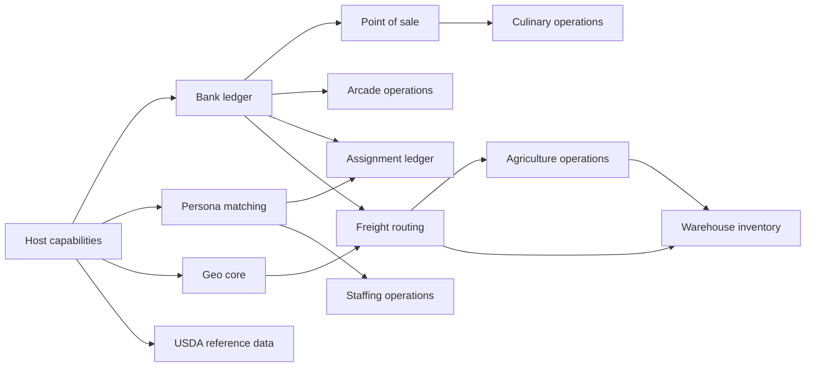

# SaaS Kit Migration

## Purpose

K3H4 will split its product implementations into SaaS Kits that can first run
inside this monorepo and later be uploaded as individual K3H4 modules. A Kit is
a module with a small interface of commands and queries. Its implementation
owns its records, validation, derived views, and business rules. Fastify routes,
React state, and dashboard composition are adapters, not the Kit interface.

This is an extraction plan, not a rewrite. Existing routes, endpoint paths,
actor/entity records, telemetry event names, and UI behavior remain stable while
each Kit moves behind its seam.

## Kit Shape

Each Kit will begin under `apps/api.k3h4.io/src/kits/<kit-name>/` with:

- `index.ts`: the external interface: command/query types and one Kit entry
  point.
- `implementation.ts` or internal files: behavior hidden from callers.
- `fastify.ts`: the optional Fastify adapter that maps HTTP to Kit commands.
- `*.test.ts`: tests that cross the same interface as callers.

The host supplies authentication, a transaction-capable persistence adapter,
and telemetry recording. A Kit must not expose Fastify requests, replies,
Prisma entities, or entity metadata as part of its interface. The current
`geo-map-bootstrap` Kit is the first migration and establishes the route-to-Kit
adapter pattern.

The actor/entity model, identity, telemetry, cache primitives, and provider
clients are host capabilities. They are not vertical SaaS Kits. A vertical Kit
may depend on a host capability, but it must not reach sideways into another
vertical's implementation. When a cross-Kit operation requires atomicity, both
Kits participate in the same host transaction rather than publishing a Prisma
transaction type.

## Inventory

| Kit | Current implementation | Interface to stabilize | Dependencies | Migration position |
| --- | --- | --- | --- | --- |
| Bank ledger | `routes/bank.ts`, `actors/Bank/Bank.ts`, bank frontend store | Read balance; list transactions; apply a balance change; record a ledger entry | Host persistence, actor/entity capability | 1 |
| Persona matching | `routes/persona.ts`, `entities/Persona/Persona.ts`, ONNX helper | Manage personas and attributes; list compatibility; recompute compatibility; evaluate labelled pairs | Host cache, optional ONNX adapter | 2 |
| Point of sale | `routes/point-of-sale.ts`, `entities/PointOfSale/PointOfSale.ts` | Manage stores; issue a ticket; read sales overview | Bank ledger, host persistence | 3 |
| Culinary operations | `routes/culinary.ts`, `entities/Culinary/Culinary.ts` | Manage menu items, prep tasks, supplier needs; read kitchen overview | Point-of-sale query interface | 4 |
| Arcade operations | `routes/arcade.ts` | Manage machines, player cards, top-ups, sessions, prizes, and redemptions | Bank ledger | 5 |
| Assignment ledger | `routes/assignment.ts`, `actors/Assignment/Assignment.ts` | Manage assignments; log timecards; pay timecards; read assignment view | Persona query interface, Bank ledger | 6 |
| Staffing operations | `routes/staffing.ts`, `actors/Staffing/Staffing.ts` | Manage engagements, roles, candidates, shifts, placements, and coverage | Persona query interface | 7 |
| Geo core | `routes/geo.ts`, Geo actor/cache modules | Find POIs; resolve routes; persist map preferences; read map history | Provider adapters, host cache and preferences | 8 |
| Geo map bootstrap | `kits/geo-map-bootstrap/`, `routes/frontend.ts` | Build initial map state from preferences, history, cache, and optional POI detail | Geo core, preferences, POI enrichment | Migrated first |
| Freight routing | `routes/freight.ts`, `actors/Freight/Freight.ts` | Plan, view, complete, and settle loads; retrieve route directions | Geo route query interface, Bank ledger, OSRM adapter | 9 |
| Agriculture operations | `routes/agriculture.ts`, `actors/Agriculture/Agriculture.ts` | Manage plots, slots, plans, tasks, inventory, movements, shipments, and resource library | Freight query interface, host persistence | 10 |
| Warehouse inventory | `routes/warehouse.ts`, `actors/Warehouse/Warehouse.ts` | Manage stock and location; attach optional freight load or agriculture slot | Freight query interface, Agriculture query interface | 11 |
| USDA reference data | `routes/usda.ts` and USDA/cache modules | Query and refresh agricultural reference datasets | USDA and Wikidata provider adapters, host cache | 12 |
| AI insights and chat | `routes/ai-insights.ts`, `routes/chat.ts`, Ollama modules | Generate insight; execute AI operation; manage chat session | Ollama adapter, telemetry, host persistence | 13 |

Authentication, profiles, actor/entity CRUD, telemetry, MapTiler, OSRM proxying,
Wikidata, POI enrichment, and cache implementations remain host capabilities.
They require their own cleanup work but are not industry Kit candidates.

## Dependency Order

The UI groupings do not alter this order. `StorefrontsDashboard` combines
Culinary, Arcade, and Point of Sale for convenience, but those are three Kits.
Likewise, `LogisticsDashboard` combines Freight, Warehouse, Agriculture, and
USDA while their ownership remains separate.

## Migration Waves

### Wave 0: Establish the Kit contract

1. Keep the new `geo-map-bootstrap` Kit as the reference implementation.
2. Add a shared internal Kit test harness for host authentication, persistence,
   and telemetry adapters only after a second Kit needs it.
3. Make route files thin adapters: parse HTTP, call one Kit command or query,
   record telemetry, and map Kit errors to HTTP responses.
4. Preserve existing endpoint paths until a published module has a versioned
   compatibility contract.

### Wave 1: Extract independent foundations

1. Extract Bank ledger first. It is small enough to prove cross-Kit transaction
   participation and is already consumed by several verticals.
2. Extract Persona matching next. Its compatibility calculation and optional
   ONNX evaluation become implementation details behind a small query/command
   interface.
3. Extract Point of Sale after Bank ledger, then Culinary. This removes an
   existing direct read from Culinary into Point of Sale while keeping the
   storefront dashboard unchanged.
4. Extract Arcade after Bank ledger. Do not combine it with Point of Sale just
   because both appear on the storefront screen.

### Wave 2: Extract workforce and logistics workflows

1. Extract Assignment ledger after Bank ledger and Persona matching. Its payout
   flow must remain atomic with the ledger entry.
2. Extract Staffing operations after Persona matching. The Kit receives persona
   summaries through the Persona query interface rather than importing persona
   records directly.
3. Separate Geo core from its Fastify routes before moving Freight routing. The
   existing map-bootstrap Kit remains a consumer of the Geo query interface.
4. Extract Freight routing after Geo core and Bank ledger; its OSRM cache,
   direction normalization, settlement, and load lifecycle belong in one Kit.
5. Extract Agriculture operations, then Warehouse inventory. Warehouse may
   request freight-load and agriculture-slot summaries but never mutate those
   implementations directly.

### Wave 3: Extract provider-backed and supporting products

1. Extract USDA reference data with explicit USDA and Wikidata provider
   adapters. Keep refresh/caching strategy internal.
2. Extract AI insights and chat only after their Ollama configuration is behind
   one provider adapter.
3. Review MapTiler, OSRM, POI enrichment, and Wikidata as host capabilities;
   publish only when a second independently uploadable Kit requires each one.

## Extraction Checklist

For every Kit:

1. Write a focused interface test before moving implementation behavior.
2. Move command/query behavior out of the route without changing the endpoint
   response or telemetry event name.
3. Replace direct vertical imports with a Kit interface at the new seam.
4. Keep database migration and actor/entity record formats backward compatible;
   do not create a new table solely to make a Kit look independent.
5. Add an adapter-level route test for authentication, validation, error mapping,
   and telemetry.
6. Run the focused Kit and route tests, then inspect the diff for any metadata
   or endpoint contract drift.
7. Publish only after the Kit has two real host contexts or a confirmed K3H4
   module-upload contract. Until then, a source-level Kit gives the same
   locality without prematurely widening its interface.

## First Implementation Queue

1. Bank ledger Kit
2. Persona matching Kit
3. Point of Sale Kit
4. Culinary operations Kit
5. Arcade operations Kit

This queue starts with the smallest high-leverage interfaces and establishes
the transaction collaboration pattern before touching the largest route files:
Agriculture (1,321 lines), Staffing (1,003), Geo (936), and USDA (886).